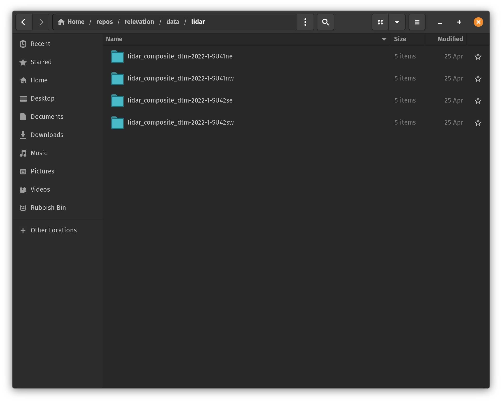

# relevation

This package is provided to facilitate the use of the elevation data provided by DEFRA. Its primary benefits are the automatic mapping of the data from the OS grid reference system to latitude/longitude, and the scalability of the backend database.

This package is designed for applications which involve fetching the elevation for a large number of coordinates across a wide area. It will be overkill for anything which works within a few square kms, or fetches the elevation for one point at a time. Loading the data into cassandra introduces an overhead which can only be justified when the script retrieving the data is parallelised.

## Future Development

The code provided here is currently to be considered an MVP. The rough roadmap for development includes the following changes:

* Fully parameterise all directories & connection strings
* Set up a temporary container to improve the quality of unit tests for any database utilities
* Ensure complete unit test coverage
* Automate the ingestion of new data files with Apache Airflow (or similar)
* Switch over to a cloud based database solution, with logic in place to handle provisioning of resources (Teraform?)
* Optimise database performance for rapid retrieval of elevation data
* Convert any existing pandas code across to polars

As this repo forms one part of a larger project, it may be subject to major restructuring, or merged with other parts of the code-base as architectural decisions are made. While you are free to use & modify it as you see fit, no warranty is provided and you do so entirely at your own risk.

## Installation

In order to use the python code in this package, it must be installed to your current python environment. Once the contents of the repo have been cloned, this can be done by entering `pip install .` in a terminal in the root of the repo.

In order for the code to function, a containerised cassandra database will need to be visible on port 9042 of the local machine. The automatic setup of this cluster will be managed via a config file in a future build. A sample docker compose.yaml file is provided in the 'backend' folder for reference.

## Usage

Make sure your database is up and running before attempting to run any of the code here.

### Downloading Data

In main.py, you will need to specify a data folder. This will need to contain two subfolders, 'lidar' and 'csv'. The location of this folder should be set as the `DATA_DIR` parameter. In the example below, I have set this to '~/repos/relevation/data'.

Elevation data can be downloaded from 'environment.data.gov.uk/survey'. Select the areas you need and select 'Composite DTM 1m' when prompted to select a format. Extract all of your files into the 'lidar' folder.



### Ingestion

In order to ingest the files you have extracted, you will need to spin up a Cassandra cluster. A basic docker compose file for this is provided in the './backend' folder, although you may wish to tweak this depending on the resources your device has available. This cluster will need to expose port 9042 for inbound database queries.
Once running, adjust the `CLUSTER_URL` parameter in main.py to enable the use of the python Docker API to interface with the cluster.
Once `DATA_DIR` and `CLUSTER_URL` have been set, execute main.py and your files will be uploaded.

### Ongoing Usage

At present, this package exposes two functions to the user. Both of these require that the underlying Cassandra cluster is active, and has been provided with some data.

```python
from relevation.db import get_elevation

lat = ...
lon = ...

elevation = get_elevation(lat, lon)
```

The `get_elevation` function will simply return the elevation (in metres) for a single point. If the LIDAR file which contains this point has not been provided, this function will return `None` instead.

```python
from relevation.db import get_distance_and_elevation_change

start_lat = ...
start_lon = ...
end_lat = ...
end_lon = ...

dist_change, elevation_gain, elvation_loss = get_distance_and_elevation_change(
    start_lat, start_lon, end_lat, end_lon
)
```

The `get_distance_and_elevation_change` function will estimate the distance and change in elevation between two points. Elevation change is estimated by sampling the elevation at 10 metre intervals between the start and end point, while the distance is simply calculated as the number of kilometres between the start and end point (this is provided by the `geopy.distance.distance` function).